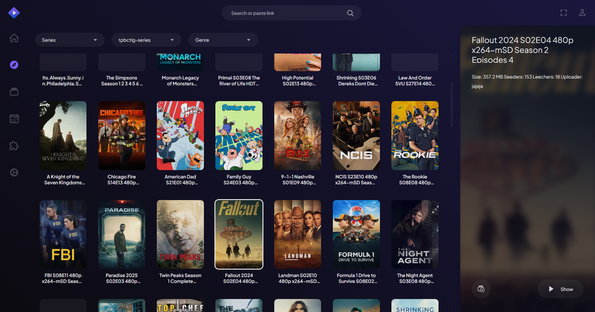
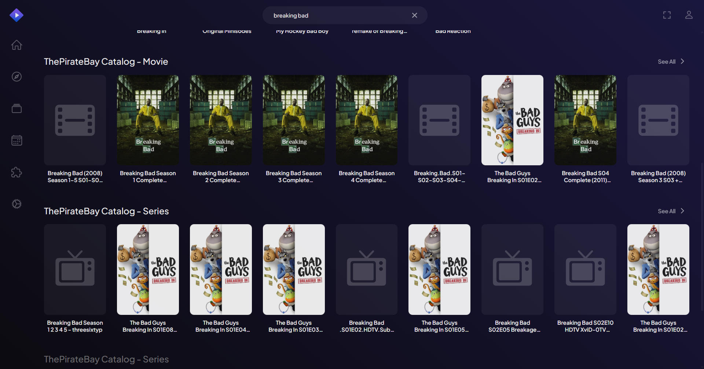

# 2026 now working!!

# ThePirateBay Catalog add-on for Stremio

### Show movies or series torrents by category from ThePirateBay




### Search movies or series torrents from ThePirateBay



## I not a programmer, please give me the .exe file

Here, your **.exe** file:

**https://github.com/Nekitaw/thepiratebay-catalog/releases/tag/build**

1. Download bin (if your O.S. is Windows, download Windows version)
2. Run
(do this once:)
3. Open Stremio
4. **Add addon**
5. Paste this url: `http://127.0.0.1:7000/manifest.json`
6. Click Add
7. Catalogs will loaded

Every time before you open Stremio, run the `tpb-windows` or `tpb-linux` 
If Windows Firewall asks, click the **Allow** button.

## To run plugin locally

```bash
npm install
npm start
```

Then run Stremio, click the add-on button (puzzle piece icon) on the top right, and write `http://127.0.0.1:7000/manifest.json` in the "Addon Url" field on the top left.

~~Addon public url: https://5db836ec3ef8-thepiratebay-ctl.baby-beamup.club~~

Buy Me A Beer: `1KuCYGRWnBQDAgFiEuXc3Mtpk2yjMDadLo` BTC Wallet
